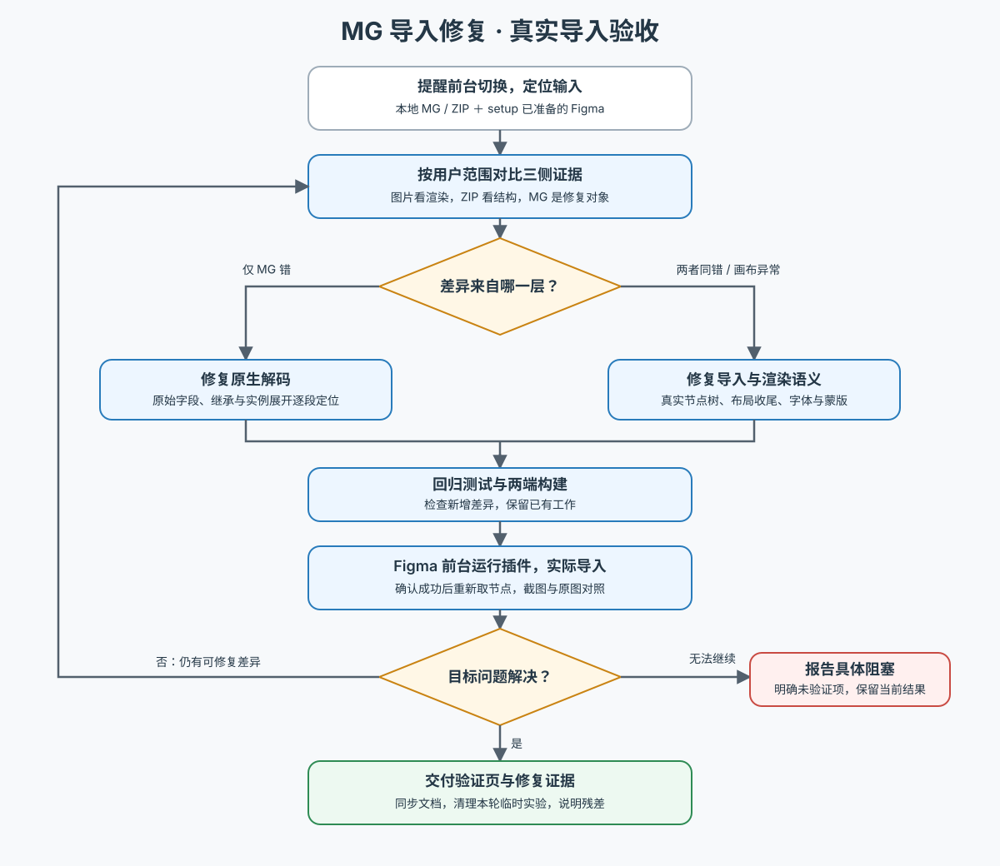

# MG 导入还原修复

读取 [执行工作流](docs/workflow.md)，按用户本次范围处理整页或单层差异；继续同一批次时只需复核相关阶段及当前页面状态。文件默认已在本仓库目录，Figma 已由 `mg-import-setup` 准备，不要求用户重复提供路径或重新初始化。

开始操作前按工作流提醒用户：执行中会切换 Figma 到前台，建议期间尽量不要操作电脑。这是操作提醒，沿用会话已有授权，不增加确认步骤。

`_image` 是渲染基准，`_zip` 是结构辅助，`_mg` 是修复对象。最终通过更新后的插件真实导入并对照原图验收，直接修改画布不能替代这一验证。

下图概览输入、分诊与修复验证循环；详细异常恢复和完成条件见文本工作流。

