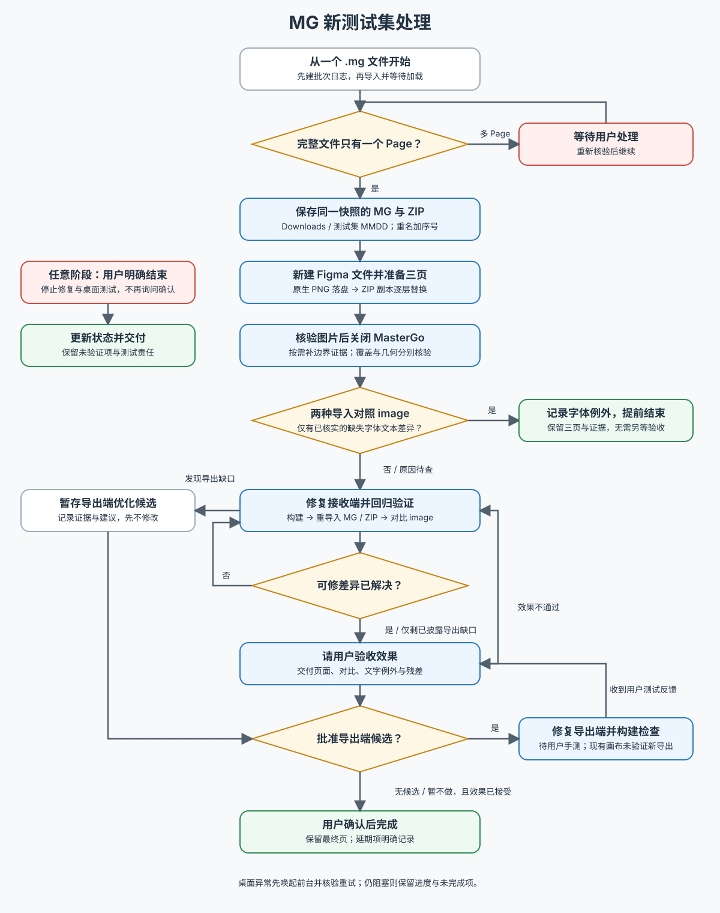

# MG 新测试集处理与导入修复

先读 [执行工作流](references/workflow.md)，它是阶段、Gate、范围和完成条件的唯一事实源。新测试集从 `.mg` 开始；已有批次可核实后续作，局部请求遵守用户指定范围。

准备三页时读 [初始化操作细节](references/setup.md)；开始排查时读 [修复与回归细节](references/repair.md)。图片阶段使用 [剪贴板脚本与操作说明](references/images.md)，首选逐层保存 PNG、复制 ZIP 页后替换粘贴。取证与剪贴板脚本均在 `scripts/`，从仓库根运行。

完整流程自动准备 `_mg` / `_zip` / `_image`，完成后释放 MasterGo 资源。若两个导入页与 image 的差异经核实仅由字体缺失造成，可记录证据并提前结束；其余情况持续修复接收端，最终等用户确认效果。多 Page 时等用户处理。SendToFigma 导出优化只记录候选，获用户确认后实施；ZIP／导出端修复完成代码、自动化检查与构建后交用户手动测试，不自动重开 MasterGo。

首次桌面操作前建立批次日志，顶部持续维护最新状态。用户明确结束时立即收尾，保留未验证项和测试责任，不再索取结束确认。

下图展示单 Page Gate、图片取证、提前结束、修复与验收，以及导出端交用户手测的分支。

