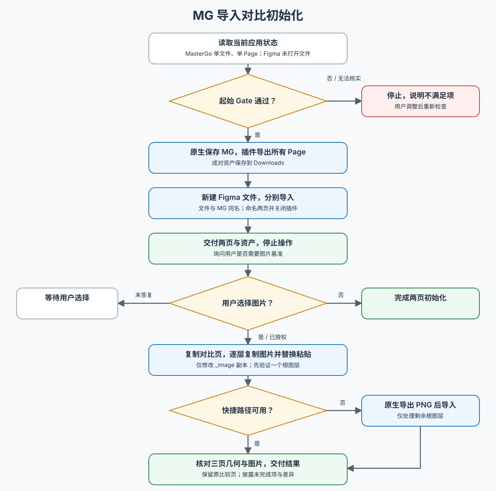

# MG 导入对比初始化

执行前读取 [工作流](docs/workflow.md)，它是 Gate、操作顺序、图片授权和验收条件的事实源。仅继续图片阶段时，读取其中的图片阶段与恢复规则，并核实上一阶段产物。

使用 Computer Use 操作 MasterGo 原生保存、SendToFigma 导出以及 Figma 新建文件和 ReceiveFromMasterGo 导入。调用 Computer Use 前读取工具返回的当前 API 文档；只有需要通过 Figma API 精确读取或设置页面、图层几何时，才加载当前环境的 `figma:figma-use` 技能并遵守其调用要求。不要猜测工具、快捷键或插件入口。

本技能只准备可比较的样本，不执行解码器修复、导入器修复或修改源设计。用户后续要求修复时再转入仓库的 `mg-import-fix` 技能。

下面的流程图展示起始 Gate、两个必需对比页，以及用户选择后的图片阶段。

